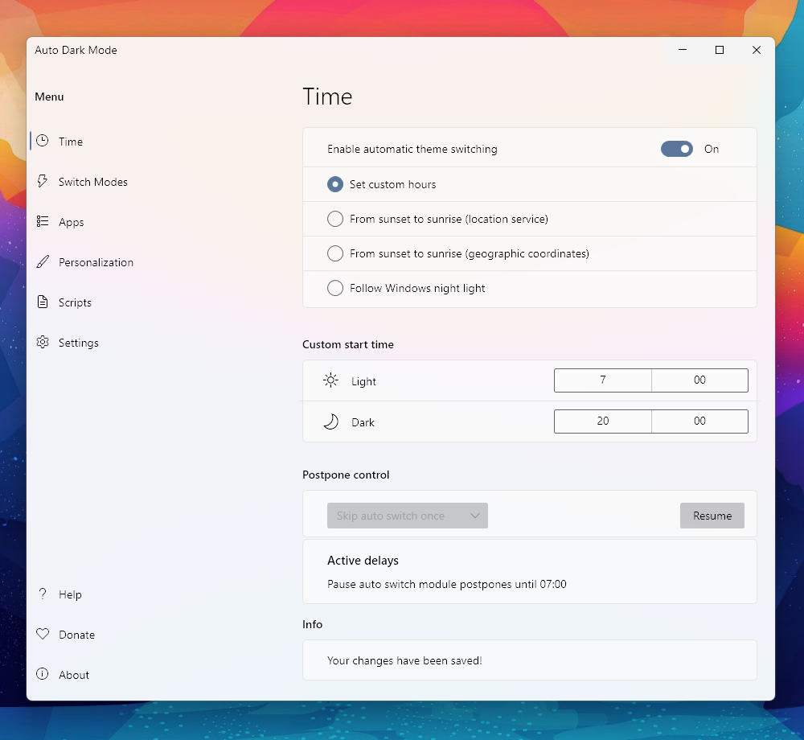
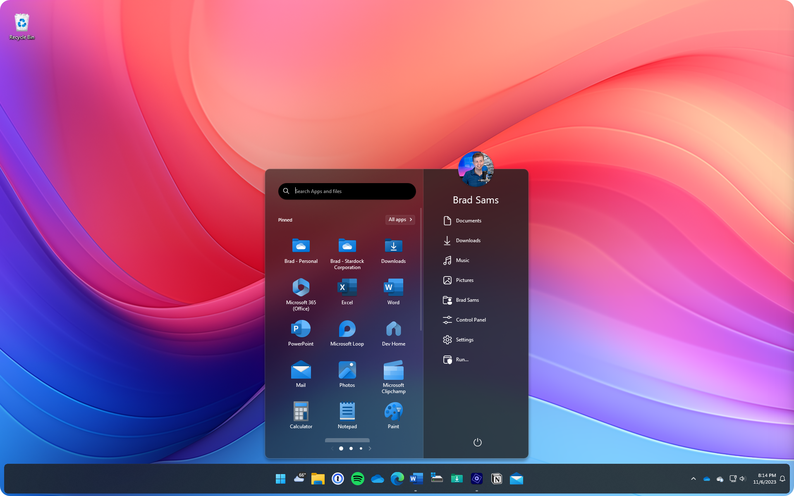
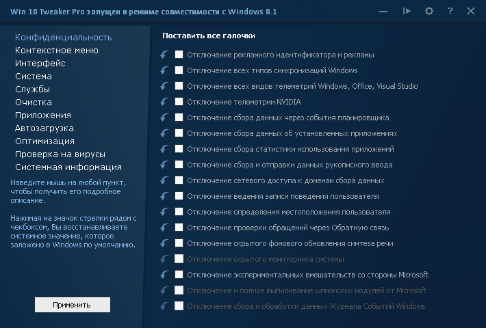
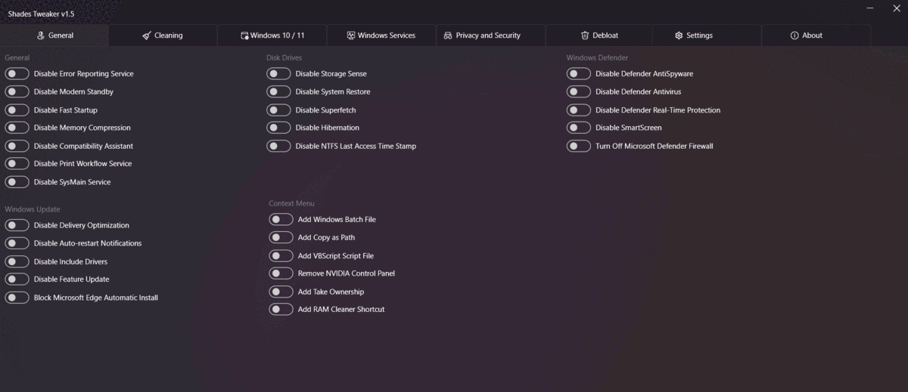
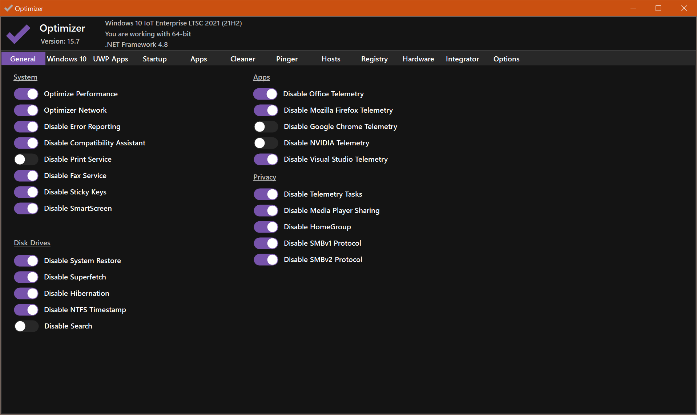
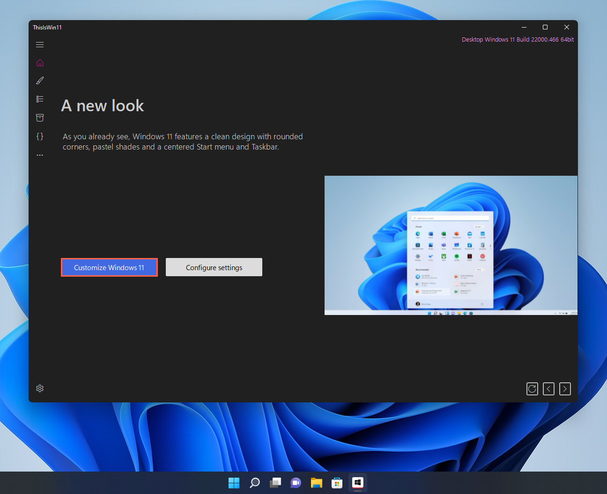

# Корисні програми для windows.

- ## Кастомізація:
  - [TaskBarX](https://github.com/ChrisAnd1998/TaskbarX)
    Центруйте іконки панелі завдань Windows за допомогою різноманітних анімацій та опцій.
    
  - [TaskbarXI](https://github.com/ChrisAnd1998/TaskbarXI)
    Додаток, написаний на C++ для модифікації панелі завдань Windows 11.
    
  - [AutoDarkMode](https://github.com/AutoDarkMode/Windows-Auto-Night-Mode) - Автоматично перемикається між темною та світлою темою Windows 10 і Windows 11
    
  - Робочій стіл
    - [wallpaperengine](https://www.wallpaperengine.io/en)
      Використовуйте приголомшливі живі шпалери на робочому столі Windows. Анімуйте власні зображення для створення нових шпалер або імпортуйте відео та веб-сайти і діліться ними з іншими!
      [Якщо скупий](https://1progs.ru/wallpaper-engine/)
    - [rainmeter](https://www.rainmeter.net/)
      Rainmeter дозволяє відображати настроювані скіни на робочому столі, від лічильників використання обладнання до повнофункціональних аудіовізуалізаторів.
      
      - Скіни:
        - [droptopfour](https://droptopfour.com)
          Панель випадаючого меню та запуск додатків для Windows та Rainmeter
          
        - [JaxCore](https://github.com/Jax-Core/JaxCore)
          Чудовий набір інструментів та віджетів, які прикрасять ваш робочий стіл.
          
  - [start11](https://www.stardock.com/products/start11/) - найдосконаліше меню «Пуск»
    
- ## Програми для встановлення ос
  - [flashr](https://flashr.ru/) - альтернатива для rufus
    
  - [aomei-backupper](https://www.aomeitech.com/aomei-backupper.html) - программа для бекапу вашої windows. [Я скупий](https://1progs.ru/aomei-backupper/)
    
- ## Tweaker`и
  - [win10tweaker](https://win10tweaker.ru/)
    
  - [ShadesTweaker](https://github.com/shadesofdeath/ShadesTweaker)
    
  - [optimizer](https://github.com/hellzerg/optimizer)
    
  - [ThisIsWin11](https://github.com/builtbybel/ThisIsWin11)
    
  - ## Маленькі корисні програми
    - [Minibin](https://github.com/king-tri-ton/minibin) - це невелика утиліта для очищення кошика в операційній системі Windows 10. Програма надає зручний спосіб звільнити місце на диску, позбувшись файлів у кошику.
