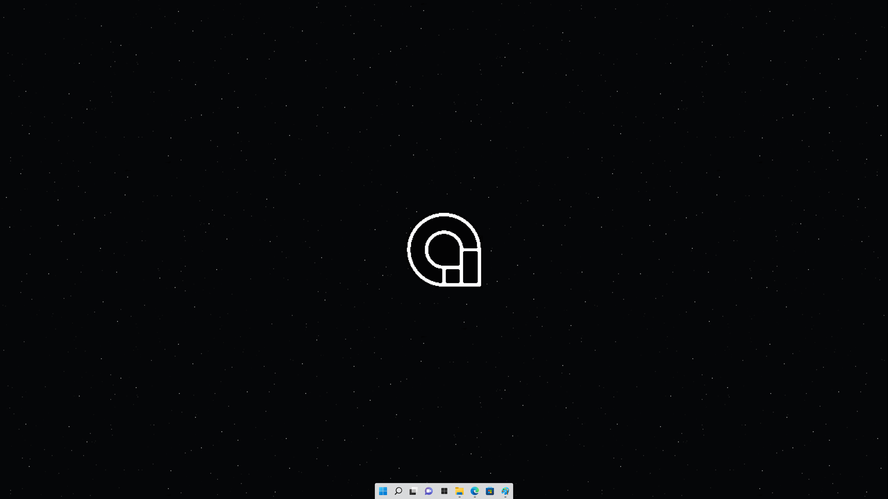
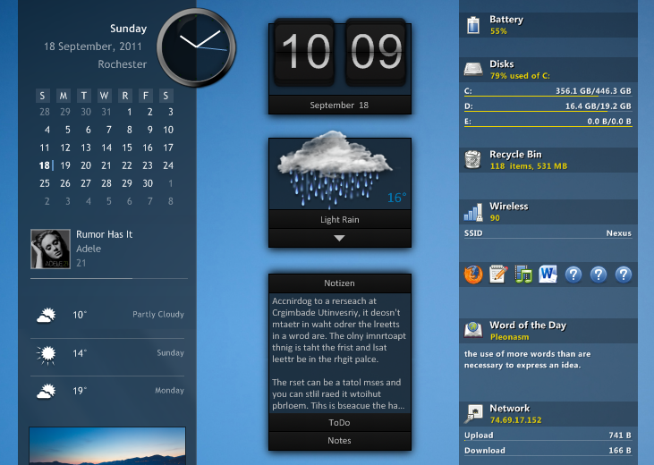
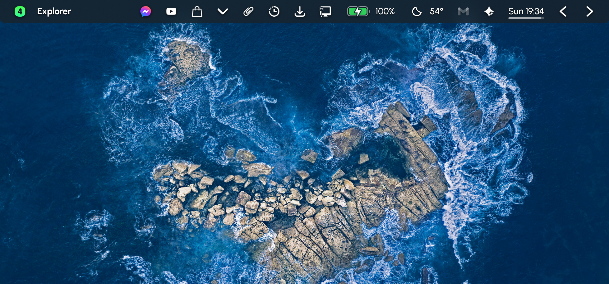
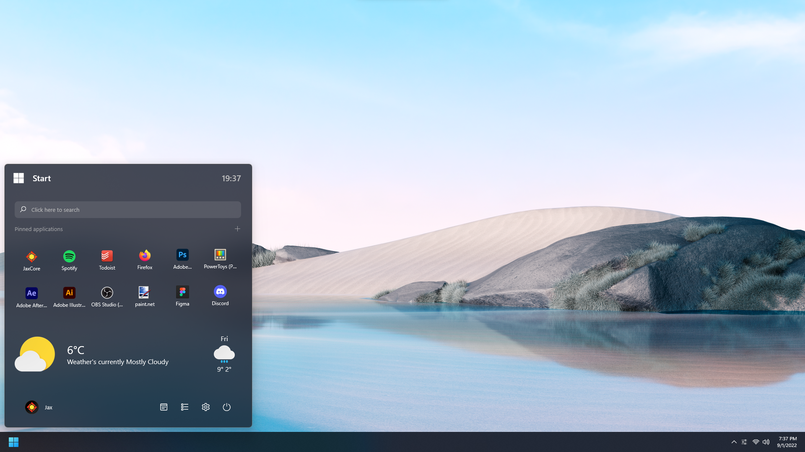
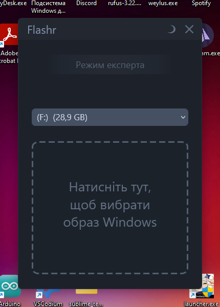

# Корисні програми для windows.

- ## TaskBar:
  - [TaskBarX](https://github.com/ChrisAnd1998/TaskbarX)
    Центруйте іконки панелі завдань Windows за допомогою різноманітних анімацій та опцій.
    
  - [TaskbarXI](https://github.com/ChrisAnd1998/TaskbarXI)
    Додаток, написаний на C++ для модифікації панелі завдань Windows 11.
    
  - [rainmeter](https://www.rainmeter.net/)
    Rainmeter дозволяє відображати настроювані скіни на робочому столі, від лічильників використання обладнання до повнофункціональних аудіовізуалізаторів.
    
  ## Скіни:
  - [droptopfour](https://droptopfour.com)
    Панель випадаючого меню та запуск додатків для Windows та Rainmeter
    
  - [JaxCore](https://github.com/Jax-Core/JaxCore)
    Чудовий набір інструментів та віджетів, які прикрасять ваш робочий стіл.
    
- ## Красиві шпалери на робочій стіл
  - [wallpaperengine](https://www.wallpaperengine.io/en)
    Використовуйте приголомшливі живі шпалери на робочому столі Windows. Анімуйте власні зображення для створення нових шпалер або імпортуйте відео та веб-сайти і діліться ними з іншими!
    [Якщо скупий](https://1progs.ru/wallpaper-engine/)
- ## Программа для встановлення ос
  - [flashr](https://flashr.ru/)
    
